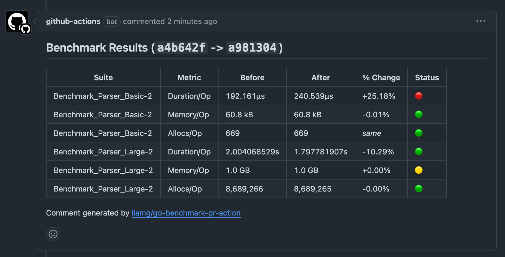

# go-benchmark-pr-action

> [!WARNING]  
> This was hacked together on my lunch break. You probably don't want to use it yet.

This is a simple GitHub action that runs benchmarks on both the head and base branch when a PR is submitted/updated.

It will post a comment showing the before/after changes, and can be configured to fail the PR check if certain regression thresholds are breached.



## Example Usage

```yml
name: Benchmarks
on:
  pull_request:

jobs:
  benchmark:
    name: Performance regression check
    runs-on: ubuntu-latest
    steps:
      - uses: actions/checkout@v4
      - uses: actions/setup-go@v4
        with:
          go-version: "stable"
      - uses: liamg/go-benchmark-pr-action@v1
        with:
          token: ${{ secrets.GITHUB_TOKEN }}
          duration_threshold: 10 # +10% regression
```

## Configuration

| Name | Description | Default | Required |
| ---- | ----------- | :-----: | :------: |
| token | Github token with permission to write PR comments | | Yes | 
| duration_threshold | Threshold for duration regression in % (use 0 for no threshold check) | `0` | No |
| memory_threshold | Threshold for memory-usage  regression in % (use 0 for no threshold check) | `0` | No |
| allocs_threshold | Threshold for allocation count  regression in % (use 0 for no threshold check) | `0` | No |
| benchmark_pattern | Pattern passed to the `-bench` option of `go test` | `.` | No |
| benchmark_package | Package to run benchmarks for e.g. `internal` | `./...` | No | 
| benchmark_seconds | Duration to run each benchmark for | 1 | No |
